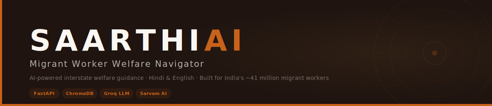

**Live demo:** https://0nca-saarthi.hf.space

A mobile-first, AI-powered welfare-navigation tool for internal migrant workers in India. Saarthi runs in the browser on any low-end Android device and helps a worker who has relocated interstate understand which portable government schemes they can access, and gives them the concrete steps to do so. Voice input and output in Hindi and English are powered by [Sarvam AI](https://www.sarvam.ai), making the tool accessible to low-literacy users without requiring a separate app install.

---

## Overview

India's ~41 million inter-state migrants face a consistent barrier: welfare entitlements earned in their home state are poorly understood, and even more poorly accessed, after relocation. Saarthi is designed specifically for the constraints of that user: a small touchscreen, an unreliable data connection, and limited reading ability. The entire UI is capped at 480px, tap targets are oversized, and voice is the primary input method.

Saarthi addresses the problem through two flows:

- **Planning flow:** conversational intake, retrieval-augmented reasoning over scheme rules, and a visual traffic-light dashboard of entitlements with document checklists, step timelines, and office maps.
- **Emergency flow:** bypasses all scheme logic and routes the user directly to the nearest physical service (hospital, shelter, police) via map. Calm, de-escalating, voice-first.

The system is honest about what it does not know. Every substantive answer is uncertainty-framed ("you *may* be eligible"), sourced to official `.gov.in` portals, and stamped with a human-attested verification date.

---

## Supported Corridors

| Corridor ID | Route | Demo Persona |
|---|---|---|
| `bihar_hyd` | Bihar → Hyderabad, Telangana | Shyam Lal, 34, construction laborer |
| `up_mumbai` | Uttar Pradesh → Mumbai, Maharashtra | Sajid, unorganized sector worker |

---

## Supported Schemes

| Scheme ID | Name | Role |
|---|---|---|
| `eshram` | e-Shram | Hub; lifetime UAN, gateway to all others |
| `onorc` | One Nation One Ration Card | Portable food security |
| `pmsby` | PM Suraksha Bima Yojana | Accidental death/disability cover |
| `pmjay` | PM-JAY (Ayushman Bharat) | Cashless hospitalisation |
| `pm_sym` | PM Shram Yogi Maandhan | Pension after 60 |
| `bocw` | BOCW Telangana | Routed-out; non-portable, state-board. User directed to District Labour Office |

---

## Architecture

```
Browser
  └── GET / → static frontend (Vanilla JS, mobile-first, max-width 480px)
  └── POST /chat → RAG pipeline
  └── POST /audio/stt, /audio/tts → Sarvam AI proxy

FastAPI (port 8000)
  ├── /chat
  │     Route → Retrieve (ChromaDB, corridor-filtered) → Synthesize (LLM) → Assemble
  ├── /audio/stt  (Sarvam proxy; keeps API key off client)
  ├── /audio/tts  (Sarvam proxy)
  └── /           (StaticFiles catch-all, registered AFTER API routes)
```

**Key design decisions:**

- **Single port, same origin.** FastAPI serves the API and the frontend on `http://localhost:8000`. The frontend uses relative URLs (`/chat`, `/audio/*`), so there is no CORS preflight and no cross-origin errors.
- **Deterministic linear pipeline.** Every `/chat` call runs a fixed stack with no loops and no dynamic tool selection.
- **LLM reasons over text only.** Dates, provenance, and map pins are computed by deterministic Python and never delegated to the model.
- **No orchestration frameworks.** No LangChain, LangGraph, LlamaIndex, or equivalent. Orchestration is a ~40-line linear function in `rag.py`.
- **CPU-only embeddings.** `BAAI/bge-small-en-v1.5` via `sentence-transformers`, embedded at ingestion and per query.

**Primary LLM:** DeepSeek V3.2 via `aicredits.in` (OpenAI-compatible endpoint)  
**Fallback LLM:** Groq `llama-3.3-70b-versatile` (auto-switches on any 429 rate-limit error)

---

## Project Structure

```
migrant-navigator/
├── backend/
│   ├── main.py           # FastAPI app: /chat, /audio/* proxy, static mount
│   ├── rag.py            # Linear pipeline: Route → Retrieve → Synthesize → Assemble
│   ├── llm.py            # DeepSeek V3.2 primary, Groq fallback, prompt assembly
│   ├── guardrails.py     # Deterministic Type A/B/C classification
│   ├── confidence.py     # Deterministic confidence scoring, zero LLM calls
│   ├── provenance.py     # min(verified_date), source dedup, curated-sample flag
│   ├── schemas.py        # Pydantic models for /chat request and response
│   ├── ingest.py         # Markdown docs → chunk → embed → ChromaDB
│   ├── config.py         # Paths, model names, port, env loading
│   └── prompts/
│       └── system_prompt.txt
├── frontend/
│   ├── index.html        # Single-page shell; all screens are hidden sections
│   ├── css/styles.css    # Native CSS, mobile-first, max-width 480px
│   └── js/
│       ├── app.js        # appState machine, screen routing, all rendering
│       ├── api.js        # fetch wrapper for /chat (relative URL)
│       ├── audio.js      # Sarvam STT/TTS, auto-play precedence rules
│       └── map.js        # Leaflet + OSM, static address-card fallback
├── data/
│   ├── raw/
│   │   ├── central/      # eshram.md, pmsby.md, pmjay.md, pm_sym.md
│   │   ├── bihar_hyd/    # onorc_telangana.md, offices_hyderabad.json
│   │   └── up_mumbai/    # onorc_maharashtra.md, offices_mumbai.json
│   └── routed_out/
│       └── bocw_telangana.md
├── chroma_store/         # ChromaDB persistent store (gitignored, regenerable)
├── .env                  # API keys (gitignored)
├── .env.example
├── requirements.txt
└── README.md
```

---

## Prerequisites

- Python **3.11** or **3.12**
- Three API keys:
  - `PRIMARY_API_KEY`: aicredits.in account key (DeepSeek V3.2)
  - `GROQ_API_KEY`: [console.groq.com](https://console.groq.com) (fallback LLM)
  - `SARVAM_API_KEY`: [dashboard.sarvam.ai](https://dashboard.sarvam.ai) (STT/TTS audio)

---

## Setup

### 1. Clone and create a virtual environment

```bash
git clone <repo-url>
cd migrant-navigator

python -m venv venv

# Windows
venv\Scripts\activate

# macOS / Linux
source venv/bin/activate
```

### 2. Install dependencies

```bash
pip install -r requirements.txt
```

All top-level packages are pinned. `tokenizers`, `transformers`, and `huggingface-hub` are intentionally not pinned; ChromaDB and sentence-transformers share transitive deps that resolve cleanly only when left free.

### 3. Configure environment

```bash
cp .env.example .env
```

Edit `.env`:

```env
PRIMARY_API_KEY=your_aicredits_api_key_here
GROQ_API_KEY=your_groq_api_key_here
SARVAM_API_KEY=your_sarvam_api_key_here
```

The server will fail loudly at startup if `PRIMARY_API_KEY` or `GROQ_API_KEY` are missing. `SARVAM_API_KEY` is required only for audio features.

### 4. Ingest the knowledge base

```bash
python -m backend.ingest
```

This reads all Markdown scheme documents under `data/`, chunks and embeds them with `bge-small-en-v1.5` (CPU), and writes the ChromaDB collection to `chroma_store/`. Re-run any time scheme docs are updated. The `chroma_store/` directory is gitignored and fully regenerable.

### 5. Start the server

```bash
uvicorn backend.main:app --reload --port 8000
```

Open **http://localhost:8000** in a browser. The same process serves the API and the frontend.

---

## API Reference

### `POST /chat`

**Request**

```json
{
  "message": "I moved from Bihar to Hyderabad last month.",
  "conversation_history": [],
  "corridor_id": "bihar_hyd",
  "flow_mode": "planning"
}
```

| Field | Type | Values |
|---|---|---|
| `message` | string | User's current message, in English |
| `conversation_history` | array | Prior turns (role/content pairs) |
| `corridor_id` | string | `bihar_hyd` or `up_mumbai` |
| `flow_mode` | string | `planning` or `emergency` |

**Response** (abbreviated)

```json
{
  "response": "Based on what you've told me, you may be eligible for ...",
  "mode": "planning",
  "verification_required": false,
  "sources": [{ "scheme_id": "eshram", "official_portal": "https://eshram.gov.in", "source_tier": "official_gov" }],
  "provenance": { "oldest_verified_date": "2026-01-15", "contains_curated_sample": false },
  "cards": [
    {
      "scheme_id": "eshram",
      "status": "green",
      "name": "e-Shram",
      "summary": "Register for your UAN; this unlocks the other schemes.",
      "detail": "...",
      "document_checklist": ["Aadhaar card", "Mobile number linked to Aadhaar"],
      "timeline": [{ "step": "Visit nearest CSC or eshram.gov.in", "has_location": true, "pin_ids": ["csc_hyd_1"] }],
      "map_pins": [{ "id": "csc_hyd_1", "label": "CSC Hyderabad Central", "lat": 17.385, "lng": 78.4867, "address": "..." }]
    }
  ],
  "flow_mode": "planning",
  "refusal": { "type": null, "reason": "" }
}
```

### `POST /audio/stt`

Multipart form proxy to Sarvam STT. Accepts `file` (audio blob) and `language_code` (`hi-IN` or `en-IN`). Returns `{ "transcript": "..." }`.

### `POST /audio/tts`

JSON proxy to Sarvam TTS. Accepts `{ inputs, target_language_code, speaker, model }`. Returns `{ "audios": ["<base64 wav>"] }`.

---

## Guardrail Types

Every `/chat` request is classified before the RAG pipeline runs. Classification is deterministic Python; the LLM may inform but never finalizes it.

| Type | Trigger | Frontend behavior |
|---|---|---|
| **A** | Non-welfare queries, jailbreak attempts, compliance violations (faking documents, gaming eligibility) | Neutral-blue redirect card; triage re-presented |
| **B** | Real welfare scheme outside the five supported (e.g. MNREGA, state housing) | Polite decline with official portal link(s) |
| **C** | Severe medical emergency, document overload, extreme policy ambiguity | Amber interrupt panel; input dock disabled until user acknowledges; human contacts (CSC, helpline 14434) provided |

---

## Audio Behavior

Auto-play is intentionally restricted:

- **Always auto-plays:** Emergency flow (every response), popup open events (Type-C panel, Help icon).
- **Manual only:** All other planning-flow messages; user taps the speaker icon on any bubble.
- **Global voiceover toggle** (top-right of chat header) suppresses manual auto-play but **cannot suppress Emergency auto-play**. This is a deliberate safety override.

Audio language follows `appState.language` (English or Hindi), not the corridor.

---

## Data Sources

All scheme content is derived from official Indian government portals. No third-party summaries.

| Scheme | Source |
|---|---|
| e-Shram | eshram.gov.in |
| ONORC | impds.nic.in / nfsa.gov.in |
| PM Suraksha Bima Yojana | jansuraksha.gov.in |
| PM-JAY | pmjay.gov.in |
| PM Shram Yogi Maandhan | maandhan.in |
| BOCW Telangana | tbocwwb.telangana.gov.in |

Office location data (`offices_hyderabad.json`, `offices_mumbai.json`) is a hand-curated illustrative sample tagged `source_tier: curated_sample`. The frontend surfaces a disclosure when any curated data is present in a response.

Human-attestation baseline for all documents: **2026-01-15**.

---

## Responsible AI Notes

- **BOCW is intentionally routed out.** The Building and Construction Workers Board is state-board-administered and non-portable. Saarthi acknowledges it exists, explains why it cannot reason over it, and routes the user to the District Labour Office. Honest decline is a feature, not a gap.
- **Uncertainty is mandatory.** The system prompt and guardrails enforce hedged language ("you *may* be eligible", "you will *likely* need") on every substantive claim.
- **Verify-at-source pointer.** Every answer ends with a link back to the relevant official portal.
- **LLM never touches deterministic facts.** Dates, provenance, and map pins are computed by Python and injected into the response payload. The model only reasons over retrieved text.

---

## What's Next

The current build covers the core welfare-navigation loop end to end. Planned extensions in priority order:

- **Broader corridor coverage.** The two-corridor architecture is route-agnostic; adding a third corridor (e.g. Odisha to Surat) requires only new scheme Markdown files, an office JSON, and a re-ingest run.
- **Scheme content refresh pipeline.** A lightweight CI job to flag when a `verified_date` is older than 90 days and surface it as a human review task, keeping the knowledge base current without a full rewrite.
- **Offline-first PWA.** Service worker caching of the static shell and last-fetched response, so the app remains usable in low-connectivity construction-site environments.
- **Expanded language support.** Sarvam's translation layer makes adding regional languages (Telugu, Marathi, Bhojpuri) a configuration change rather than a rebuild; the backend already passes `language_code` through the audio proxy.
- **Scheme update notifications.** Push alerts when a scheme the user was found eligible for changes its enrollment window or documentation requirements.
- **Accessibility audit.** Screen-reader pass and WCAG 2.1 AA compliance check, prioritising the emergency flow.
